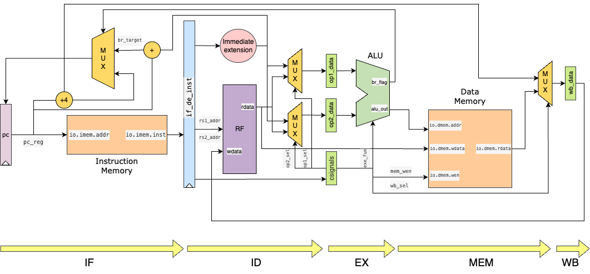

# chisel-riscv-32-cpu
基于chisel搭建的单周期五级流水线cpu

### 五级流水线结构介绍

1. **取指(fetch)** : 从内存中获取指令并将其存储在指令寄存器中。

2. **译码(decode)** : 将指令从指令寄存器中解码为可以执行的操作，并将所需的数据从寄存器或内存中读取。

3. **执行(excute)**: 执行指令所需的操作，例如算术、逻辑或分支操作。
4. **访存阶段(Memory)** : 如果指令需要访问内存，将数据从内存中读取或写入内存。
5. **写回阶段(Writeback)**:将结果写回寄存器或内存中。